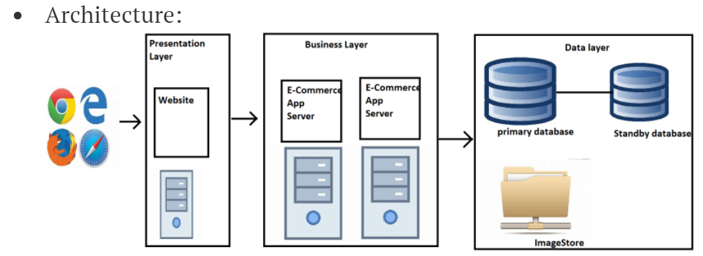
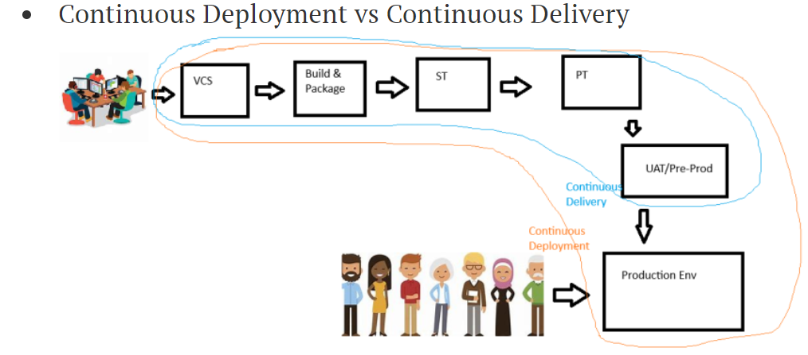
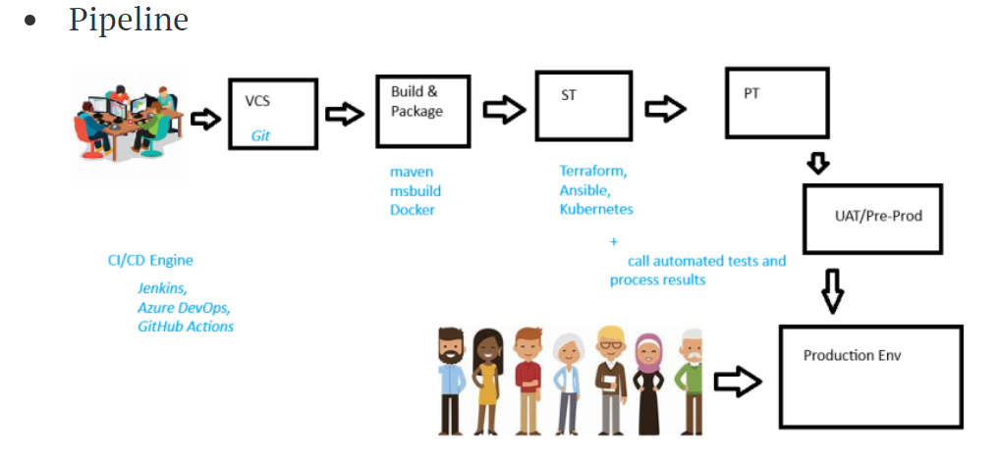
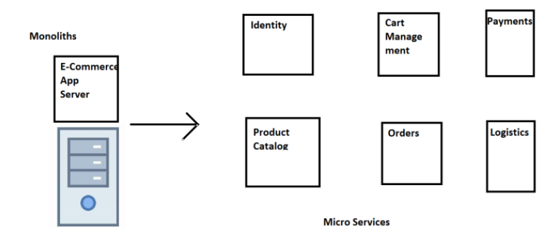
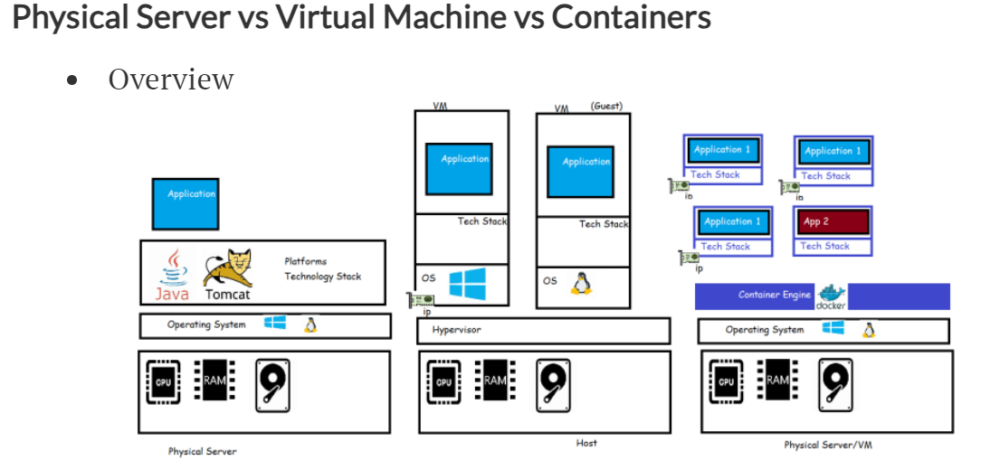
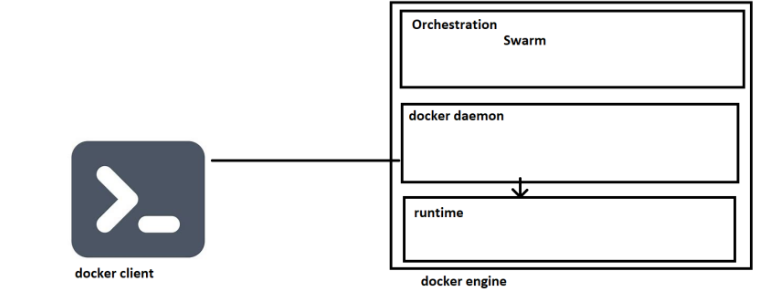
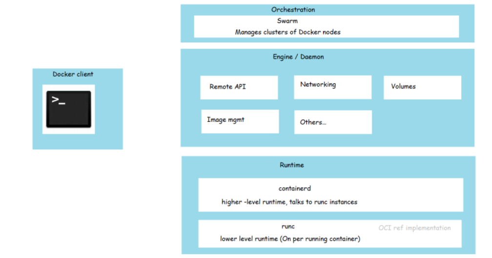

# __Scope of work__

# 04-apr-2023

## 1. Problems
    - Accesibility
    - Cross platform
    - Deployment of new features typically takes more time.
    - Portability

## 2. Solution
    - De Composing application into microservices
    - Continuous Deployment vs Continuous Delivery
    - Container technology (Docker)
    - Container Orchestration (Kubernetes)

##

***

***

## 3. Use Case Of E-Commerse 
[Reference](https://directdevops.blog/2022/01/04/devops-classroomnotes-04-jan-2022/)

# 05-apr-2023

## 4. Application deployment options

    - Generation 1: Directly run on Physical Servers
    - Generation 2: Hypervisors create virtual      machines and applications installed in virtual  machines
    - Containers

## 5. What is Docker
    - used to containerize an application
    - standard way of packaging (i.e docker image)

## 6. Assignment 1. Run Apache server
    - sudo apt update
    - sudo apt install apache2 -y
    - Now navigate to http://<publicip>

# 06-apr-2023

## 7. Docker Installation
    - Mazor Components Of Docker
        * docker client
        * docker engine
            - Orchestration
            - Docker daemon
            - Runtime
                - containerd
                - runc

***

***
## 8. Installing docker on linux
    
## 9. Docker Playground
[Reference](https://labs.play-with-docker.com/)  
[Reference](https://hub.docker.com/)

## 10. Cheatsheets
[Reference](https://docs.docker.com/get-started/docker_cheatsheet.pdf)  
[Reference](https://dockerlabs.collabnix.com/docker/cheatsheet/)  

