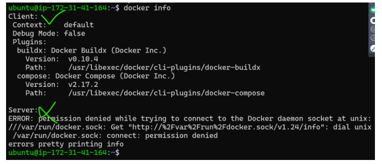

# __Scope Of Work__

# Docker Installation

## Linux VM:
OPTION 1:
- Docker can be installed by following instructions over here [Refer here](https://docs.docker.com/engine/install/) 

OPTION 2: (Prefered)  
- script based installation [Refer Here](https://get.docker.com/)  

```
curl -fsSL https://get.docker.com -o get-docker.sh
sh get-docker.sh
```



- Docker allows communication to the unix socket for the users who belong to docker group. so lets add current user to docker group  
```
sudo usermod -aG docker <username>
sudo usermod -aG docker ubuntu
```
logout and login

- Now execute 
``` 
docker container run hello-world 
```  


