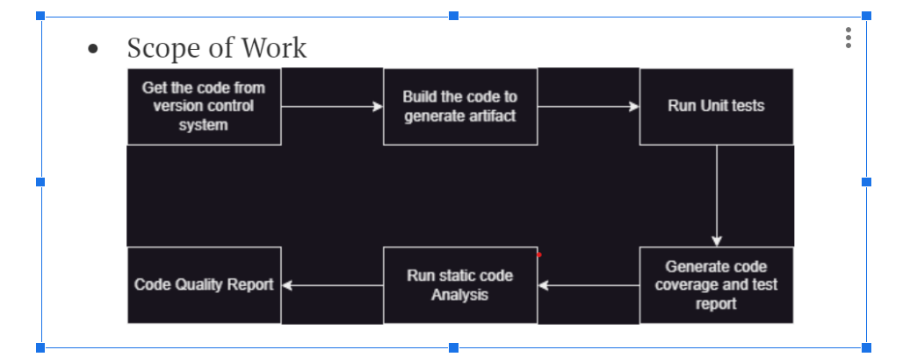
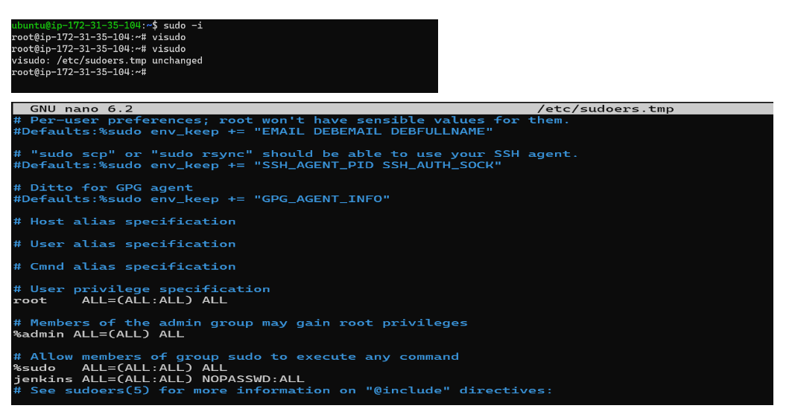

# Scope Of Work



 * Maven Installation

     Step-1
    #### Install java 17

    ```
    sudo apt update
    sudo apt install openjdk-17-jdk -y
    ```

    Step-2
    #### Installing maven option 1

    ```
    cd /tmp
    wget https://dlcdn.apache.org/maven/maven-3/3.9.3/binaries/apache-maven-3.9.3-bin.tar.gz
    sudo mkdir /usr/share/maven
    sudo tar -xvzf apache-maven-3.9.3-bin.tar.gz -C /usr/share/maven
    # add /usr/share/maven/apache-maven-3.9.3/bin to the PATH variable
    # add to ~/.bashrc or /etc/environment
    mvn --version
    ```

    #### Installing maven option 2
     *  Adding sudo permission to Linux

    ```
    sudo -i
    visudo
    ```

    

    - CTL + S -> Save for nano editor
    - CTL + X -> Exit from nano Editor

    * Install maven
    ```
    sudo apt-cache madison maven
    sudo apt install maven -y
    ```

    #### Installing Jenkins
    Step 1:
    Create a installjenkins.sh
    ```
    #!/bin/bash
    curl -fsSL https://pkg.jenkins.io/debian-stable/jenkins.io-2023.key | sudo tee \
    /usr/share/keyrings/jenkins-keyring.asc > /dev/null
    echo deb [signed-by=/usr/share/keyrings/jenkins-keyring.asc] \
    https://pkg.jenkins.io/debian-stable binary/ | sudo tee \
    /etc/apt/sources.list.d/jenkins.list > /dev/null
    sudo apt-get update
    sudo apt-get install jenkins -y
    ```

    :wq / :x  --> Save and close file of vim

    Step 2: check status of jenkins
    ```
    chmod +x installjenkins.sh
    ./installjenkins.sh
    sudo systemctl status jenkins
    ```

    

    [Refer](https://directdevops.blog/2023/07/15/devops-classroomnotes-15-jul-2023/)


    